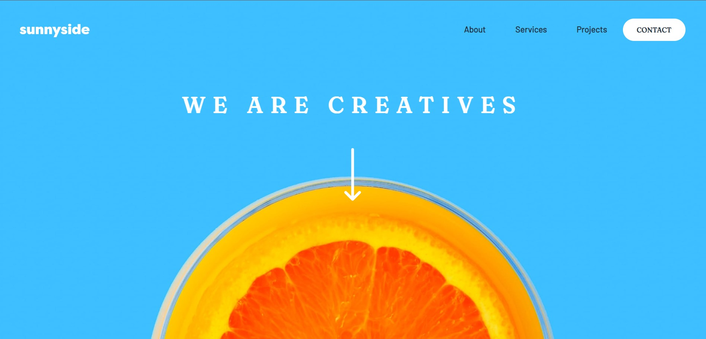
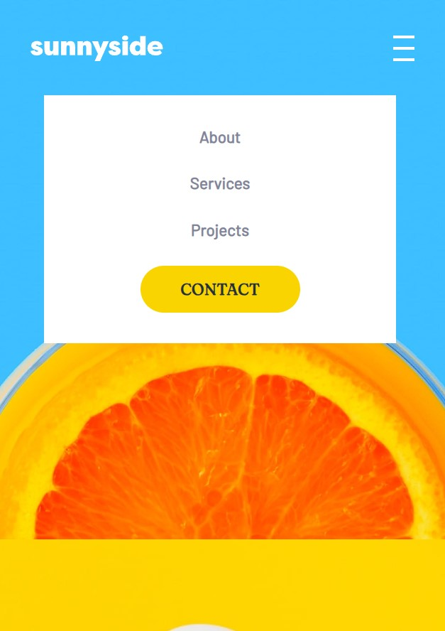

# Frontend Mentor - Sunnyside agency landing page solution

This is a solution to the [Sunnyside agency landing page challenge on Frontend Mentor](https://www.frontendmentor.io/challenges/sunnyside-agency-landing-page-7yVs3B6ef). Frontend Mentor challenges help you improve your coding skills by building realistic projects.

## Table of contents

- [Overview](#overview)
  - [The challenge](#the-challenge)
  - [Screenshot](#screenshot)
  - [Links](#links)
- [My process](#my-process)
  - [Built with](#built-with)
  - [What I learned](#what-i-learned)
- [Author](#author)

## Overview

### The challenge

Users should be able to:

- View the optimal layout for the site depending on their device's screen size
- See hover states for all interactive elements on the page

### Screenshot






### Links

- Solution URL: [https://github.com/AleksandraPetryka/Sunnyside-agency-landing-page](https://github.com/AleksandraPetryka/Sunnyside-agency-landing-page)
- Live Site URL: [https://aleksandrapetryka.github.io/Sunnyside-agency-landing-page/](https://aleksandrapetryka.github.io/Sunnyside-agency-landing-page/)

## My process

### Built with

- Semantic HTML5 markup
- CSS custom properties
- Flexbox
- CSS Grid
- Sass
- [Styled Components](https://styled-components.com/) - For styles

### What I learned

Use this section to recap over some of your major learnings while working through this project. Writing these out and providing code samples of areas you want to highlight is a great way to reinforce your own knowledge.

To see how you can add code snippets, see below:

```css
img {
  margin: 0 auto;
}
```

```js
function changeMenuVisibility() {
  let menuItems = document.getElementById("menu-items");
  if (menuItems.style.display === "") {
    menuItems.style.display = "flex";
  }
  else if (menuItems.style.display === "none") {
    menuItems.style.display = "flex";
  }
  else {
    menuItems.style.display = "none";
  }
}
```

## Author

- Frontend Mentor - [@AleksandraPetryka](https://www.frontendmentor.io/profile/AleksandraPetryka)